# Healthcare SaaS - System Architecture Documentation

## Table of Contents
1. [System Overview](#system-overview)
2. [High-Level Architecture](#high-level-architecture)
3. [Technology Stack](#technology-stack)
4. [Application Architecture](#application-architecture)
5. [Database Schema](#database-schema)
6. [Authentication Flow](#authentication-flow)
7. [Data Flow Diagrams](#data-flow-diagrams)
8. [Multi-Tenancy Architecture](#multi-tenancy-architecture)
9. [Integration Architecture](#integration-architecture)
10. [Deployment Architecture](#deployment-architecture)

---

## System Overview

This is a **multi-tenant healthcare SaaS platform** built with **Flutter** and **Supabase**, integrated with **Firebase** for push notifications. The system supports three application types:
- **Web Application** (unified portal)
- **Doctor Mobile App** (Android/iOS)
- **Patient Mobile App** (Android/iOS)

### Key Features
- Multi-tenant architecture with complete data isolation
- Role-based access control (Doctor, Admin, Patient)
- Real-time push notifications
- PDF generation for prescriptions and bills
- Medical records management
- Appointment scheduling
- Comprehensive billing system

---

## High-Level Architecture

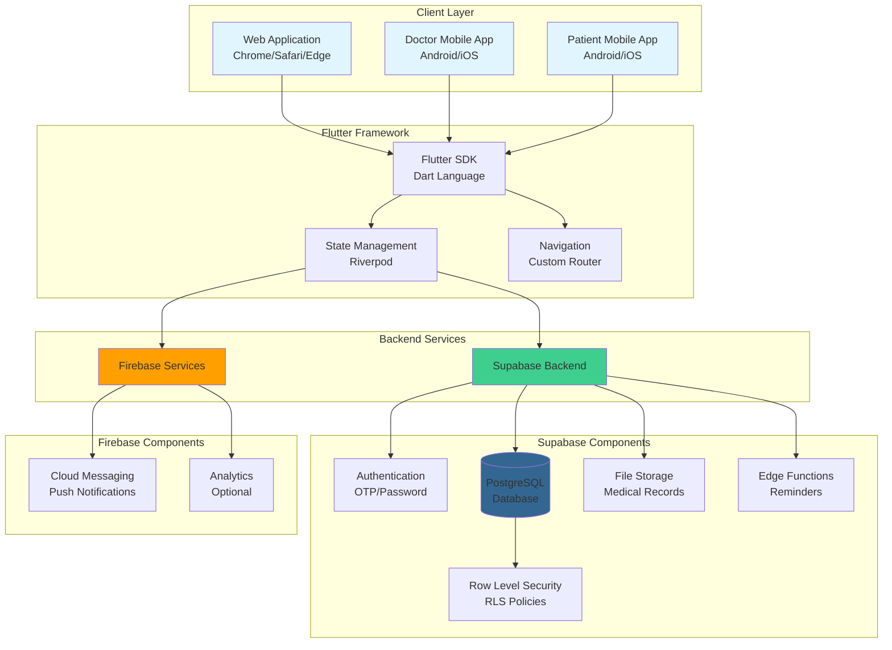

---

## Technology Stack

### Frontend
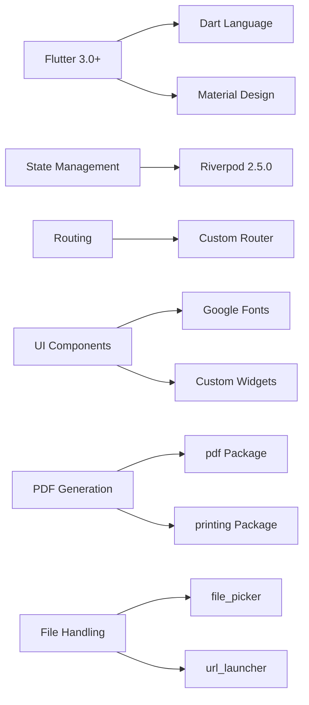

### Backend Integration
| Technology | Version | Purpose |
|------------|---------|---------|
| **Supabase Flutter** | 2.5.0 | Database, Auth, Storage |
| **Firebase Core** | 3.6.0 | Firebase SDK initialization |
| **Firebase Messaging** | 15.1.3 | Push notifications (FCM) |
| **Flutter Local Notifications** | 18.0.1 | Local notification display |
| **Flutter Dotenv** | 5.1.0 | Environment configuration |

### Database
- **PostgreSQL** (via Supabase)
- Row Level Security (RLS) enabled
- Multi-tenant data isolation
- Automatic timestamp management

---

## Application Architecture

### Project Structure

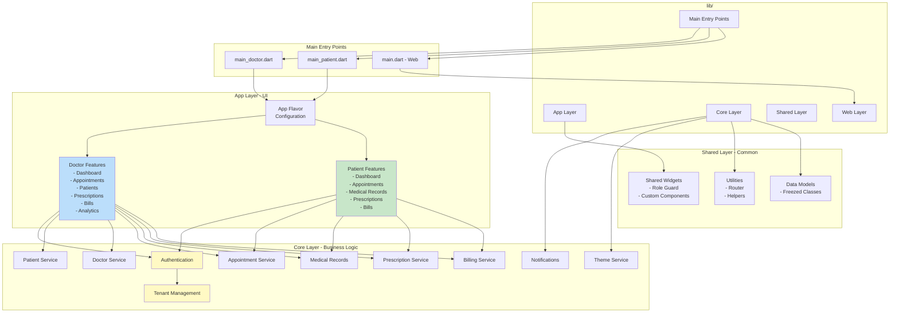

### Layer Responsibilities

#### 1. **Main Entry Points**
- `main_doctor.dart` - Doctor app initialization
- `main_patient.dart` - Patient app initialization
- `main.dart` - Web app initialization
- Initialize Firebase (push notifications)
- Initialize Supabase (database, auth, storage)
- Set app flavor
- Configure providers

#### 2. **App Layer** (`lib/app/`)
- **UI Components**: Screens and views
- **Route Definitions**: App-specific routing
- **Flavor Configuration**: Doctor vs Patient app settings
- Organized by user role (doctor/, patient/)

#### 3. **Core Layer** (`lib/core/`)
- **Business Logic**: Services and data operations
- **Authentication**: OTP, password, role verification
- **Tenant Management**: Multi-tenant operations
- **Domain Services**: Patient, Doctor, Appointments, etc.
- **Notifications**: Push notification handling
- **Theme**: Dynamic theming based on tenant branding

#### 4. **Shared Layer** (`lib/shared/`)
- **Widgets**: Reusable UI components
- **Utilities**: Common helper functions
- **Router**: Navigation logic
- **Models**: Shared data structures

---

## Database Schema

### Entity Relationship Diagram

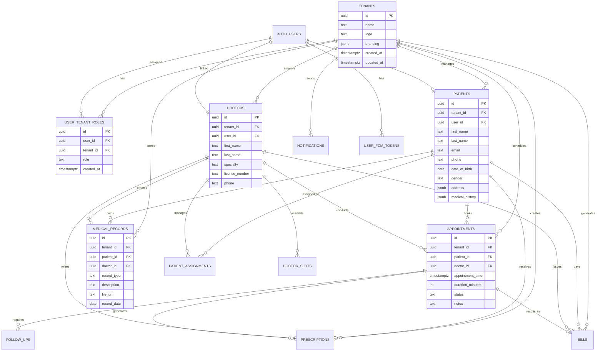

### Key Tables Overview

| Table | Purpose | RLS Enabled |
|-------|---------|-------------|
| **tenants** | Organization data and branding | ✅ Yes |
| **user_tenant_roles** | User role assignments per tenant | ✅ Yes |
| **patients** | Patient profiles and medical history | ✅ Yes |
| **doctors** | Doctor profiles and credentials | ✅ Yes |
| **appointments** | Appointment scheduling | ✅ Yes |
| **medical_records** | Medical documents and records | ✅ Yes |
| **prescriptions** | Prescription details | ✅ Yes |
| **bills** | Billing and invoices | ✅ Yes |
| **notifications** | System notifications | ✅ Yes |
| **user_fcm_tokens** | Firebase Cloud Messaging tokens | ✅ Yes |
| **follow_ups** | Follow-up appointments | ✅ Yes |
| **doctor_slots** | Doctor availability | ✅ Yes |

---

## Authentication Flow

### Login Flow Diagram

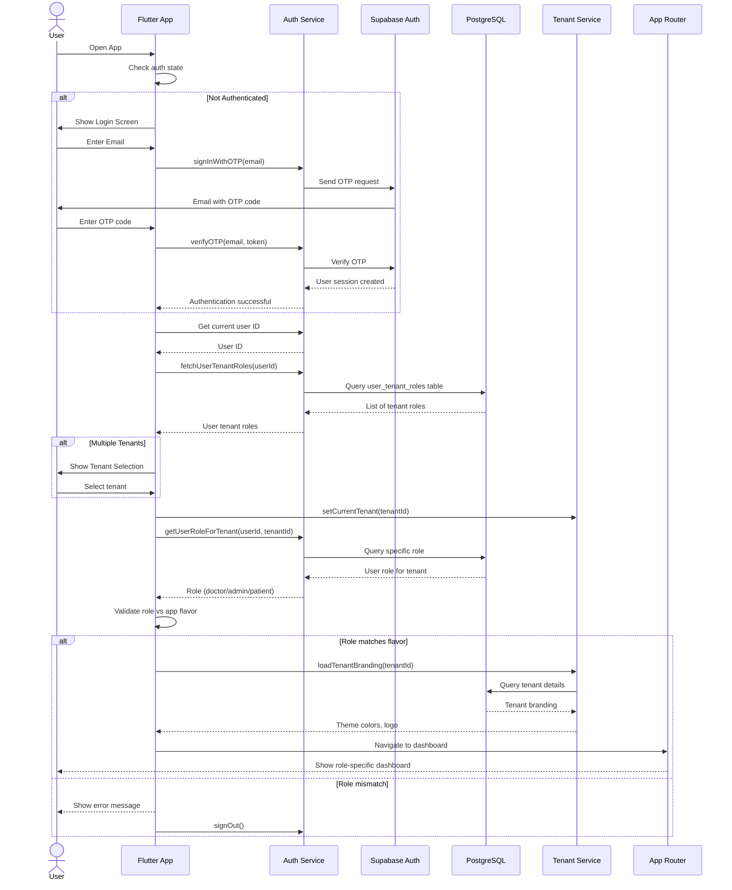

### Role Validation Process

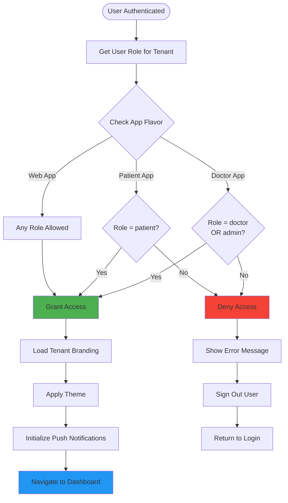

---

## Data Flow Diagrams

### Patient Appointment Booking Flow

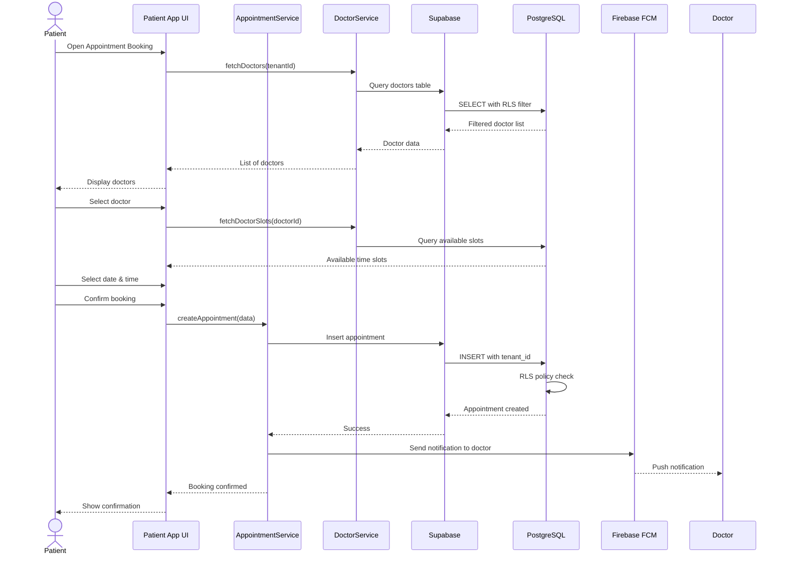

### Doctor Creating Prescription Flow

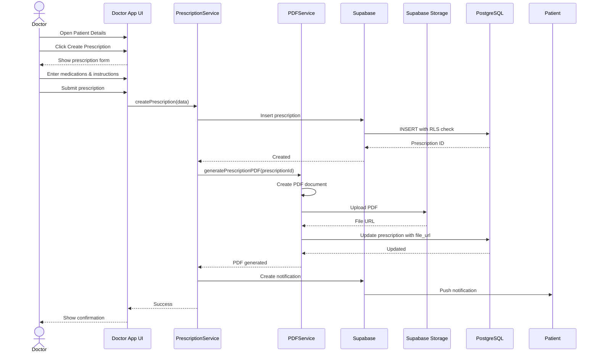

### Medical Records Upload Flow

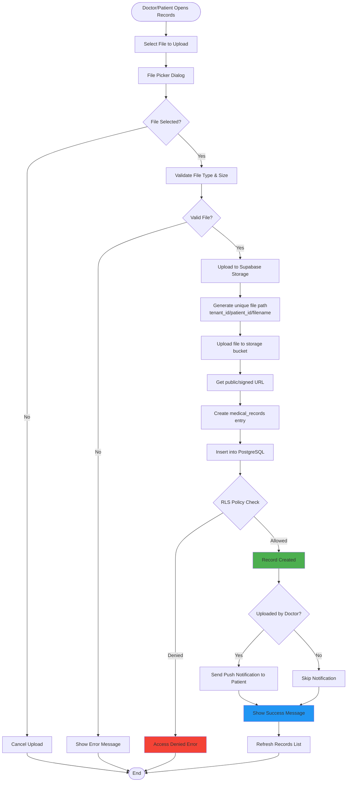

---

## Multi-Tenancy Architecture

### Tenant Isolation Strategy

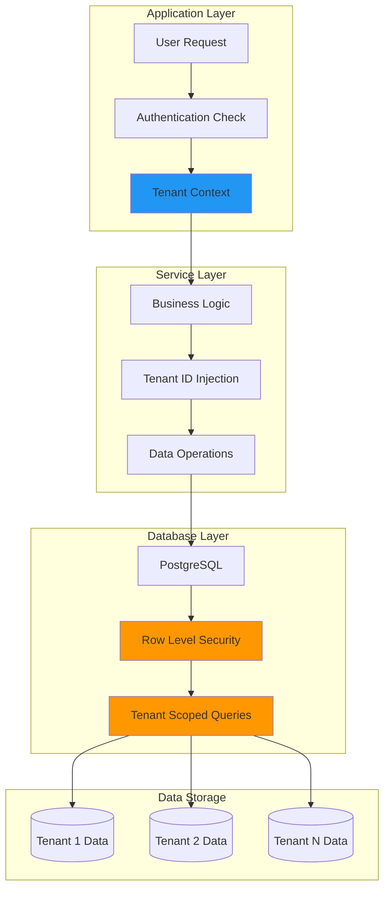

### Tenant Branding Flow

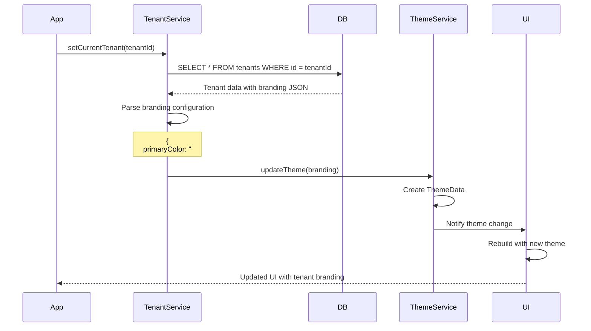

### Row Level Security (RLS) Example

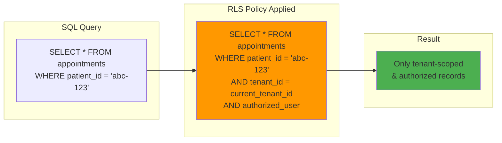

---

## Integration Architecture

### Supabase Integration

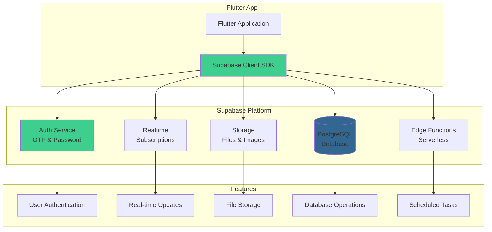

**Key Supabase Services Used:**
1. **Authentication**: Email/OTP, session management
2. **Database**: PostgreSQL with RLS policies
3. **Storage**: Medical records, X-rays, prescription PDFs
4. **Edge Functions**: Follow-up reminders, scheduled notifications
5. **Realtime**: (Optional) Real-time appointment updates

### Firebase Integration

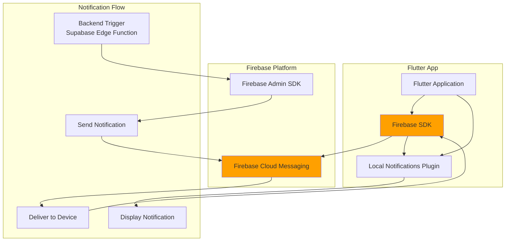

**Firebase Services Used:**
1. **Cloud Messaging (FCM)**: Push notifications
2. **Admin SDK**: Server-side notification sending (via Edge Functions)
3. **Platform-specific config**: google-services.json for Android

### Integration Data Flow

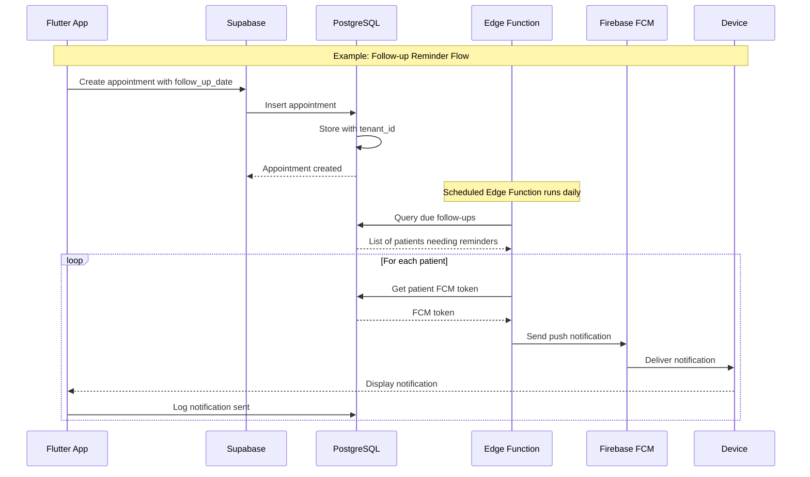

---

## Deployment Architecture

### Multi-Platform Deployment

```mermaid
graph TB
    subgraph "Source Code"
        REPO[GitHub Repository<br/>Single Codebase]
    end
    
    subgraph "Build Process"
        FLUTTER[Flutter Build System]
        FLAVORS[Flavor Configuration<br/>Doctor | Patient | Web]
    end
    
    subgraph "Web Deployment"
        WEB_BUILD[flutter build web]
        WEB_HOSTING[Static Hosting<br/>Firebase/Netlify/Vercel]
        WEB_USERS[Web Users<br/>Any Browser]
    end
    
    subgraph "Android Deployment"
        ANDROID_BUILD[flutter build appbundle]
        PLAY_STORE[Google Play Store]
        ANDROID_USERS[Android Users]
    end
    
    subgraph "iOS Deployment"
        IOS_BUILD[flutter build ios]
        APP_STORE[Apple App Store]
        IOS_USERS[iOS Users]
    end
    
    REPO --> FLUTTER
    FLUTTER --> FLAVORS
    
    FLAVORS --> WEB_BUILD
    FLAVORS --> ANDROID_BUILD
    FLAVORS --> IOS_BUILD
    
    WEB_BUILD --> WEB_HOSTING
    ANDROID_BUILD --> PLAY_STORE
    IOS_BUILD --> APP_STORE
    
    WEB_HOSTING --> WEB_USERS
    PLAY_STORE --> ANDROID_USERS
    APP_STORE --> IOS_USERS
    
    style WEB_BUILD fill:#e1f5ff
    style ANDROID_BUILD fill:#a4c639
    style IOS_BUILD fill:#000000,color:#ffffff
```

### Environment Configuration

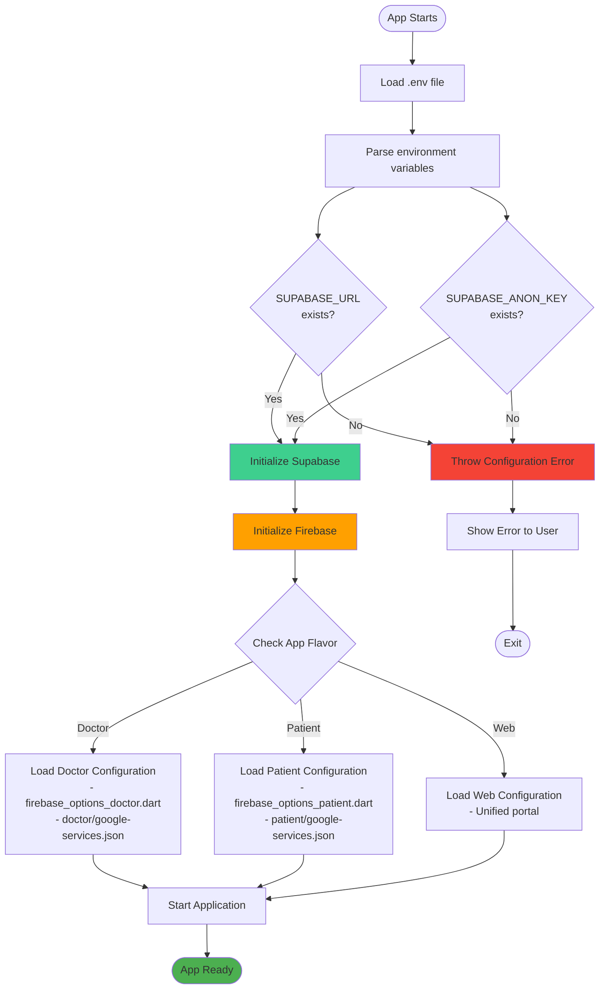

### Production Infrastructure

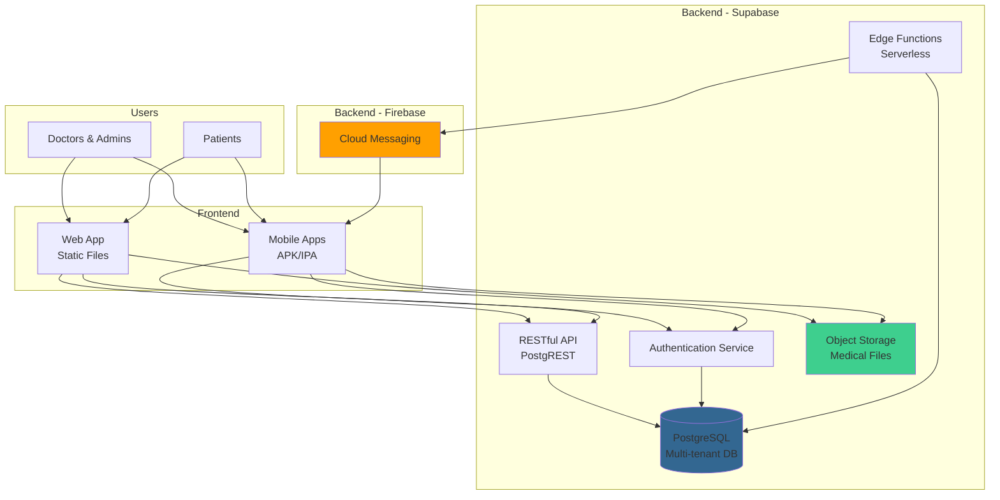

---

## Key Security Features

### Security Architecture

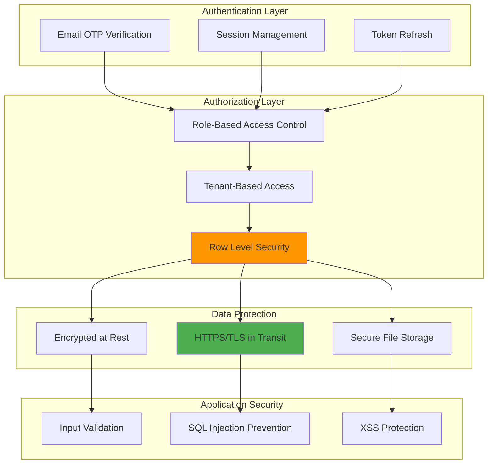

### Row Level Security Policies

**Key RLS Policies:**

1. **Tenants Table**
   - Users can only view tenants they belong to
   - Admins can update their own tenant

2. **User Tenant Roles**
   - Users can only view their own roles
   - Only service role can modify roles

3. **Patients Table**
   - Patients can view only their own data
   - Doctors/admins can view patients in their tenant

4. **Appointments**
   - Patients see only their appointments
   - Doctors see appointments in their tenant

5. **Medical Records**
   - Patients can view their own records
   - Doctors can create/view records in their tenant

---

## Summary

### System Characteristics

| Aspect | Details |
|--------|---------|
| **Architecture Pattern** | Multi-tier, Multi-tenant SaaS |
| **Frontend Framework** | Flutter (cross-platform) |
| **Backend as a Service** | Supabase (PostgreSQL) |
| **Authentication** | Supabase Auth (Email OTP) |
| **Push Notifications** | Firebase Cloud Messaging |
| **State Management** | Riverpod |
| **Multi-tenancy** | Tenant-scoped RLS policies |
| **Security** | Row Level Security (RLS) + RBAC |
| **File Storage** | Supabase Storage |
| **PDF Generation** | Client-side (pdf package) |

### Current Integration Status

✅ **Fully Integrated:**
- Supabase (Database, Auth, Storage)
- Firebase (Push Notifications via FCM)
- Multi-tenant architecture
- Role-based access control
- PDF generation
- File upload/download

### Next Steps for Integration

If you want to extend or modify the Supabase/Firebase integration:

1. **Add Firebase Analytics**: Track user behavior
2. **Add Firebase Crashlytics**: Monitor app crashes
3. **Implement Realtime**: Use Supabase Realtime for live updates
4. **Add More Edge Functions**: Automate more background tasks
5. **Implement Firebase Remote Config**: Feature flags and A/B testing

---

## Development & Build Commands

### Prerequisites
```bash
# Install Flutter dependencies
flutter pub get

# Generate code (for freezed models)
flutter pub run build_runner build
```

### Run Applications

**Web:**
```bash
flutter run -d chrome
```

**Doctor App:**
```bash
# Android
flutter run --flavor doctor --target lib/main_doctor.dart

# iOS
flutter run --flavor doctor --target lib/main_doctor.dart
```

**Patient App:**
```bash
# Android
flutter run --flavor patient --target lib/main_patient.dart

# iOS
flutter run --flavor patient --target lib/main_patient.dart
```

### Build for Production

**Web:**
```bash
flutter build web --release
```

**Android:**
```bash
flutter build appbundle --release --flavor doctor --target lib/main_doctor.dart
flutter build appbundle --release --flavor patient --target lib/main_patient.dart
```

**iOS:**
```bash
flutter build ios --release --flavor doctor --target lib/main_doctor.dart
flutter build ios --release --flavor patient --target lib/main_patient.dart
```

---

## Additional Resources

- **Supabase Documentation**: https://supabase.com/docs
- **Firebase Documentation**: https://firebase.google.com/docs
- **Flutter Documentation**: https://docs.flutter.dev
- **Riverpod Documentation**: https://riverpod.dev

---

*This architecture documentation is maintained as the system evolves. Last updated: 2026-01-01*
